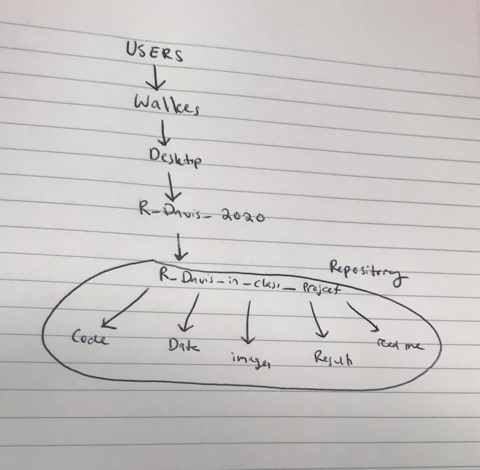

What's your name? 
Sam Walkes 

What do you study (or hope to study)?

I study eco-evo dynamics occuring during poleward range expansions. 

What's one interesting fact about you? 

One time my high school soccer team got beaten so badly it went viral on youtube. 

